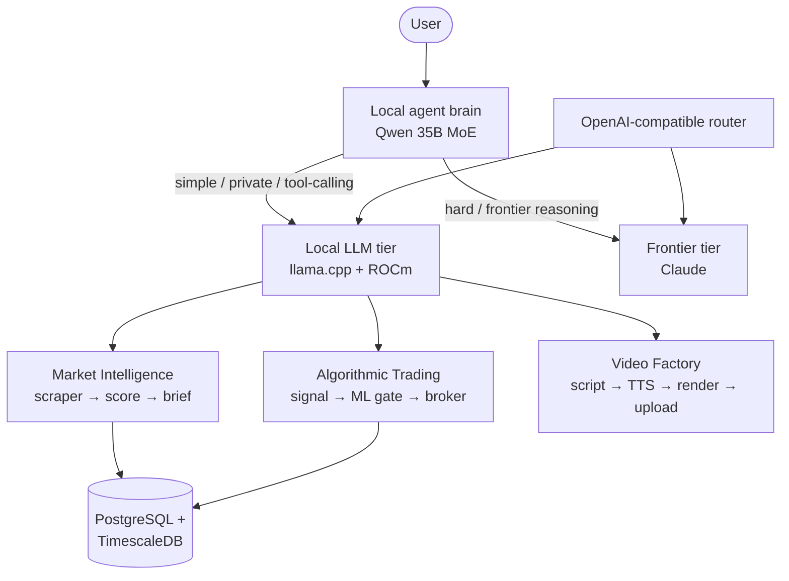

# midday-shade

A personal, self-hosted AI platform I designed, built, and run on a single consumer workstation — a 35-billion-parameter language model serving locally on a 12 GB AMD GPU, a two-layer local + frontier agent architecture, and three production-style automation systems (market intelligence, algorithmic trading, video generation) built on top of it.

This repository is a **sanitized engineering showcase**: architecture write-ups, design decisions, and representative code. The live system runs private (it holds credentials and personal data), so what's here is the engineering, not the secrets.

> **Why this exists.** Most of my measurable "AI" credentials are coursework and certificates. They badly understate what I've actually built. This is the real artifact: systems that have to stay up, stay cheap, and make correct decisions under real constraints.

---

## The system at a glance

Everything runs on one box: a Ryzen 7 5700X3D, an AMD Radeon RX 7700 XT (12 GB), and 31 GiB of RAM. The hard constraint — a 35B model on 12 GB of VRAM — drove most of the interesting engineering.

---

## Projects

### 🧠 Self-hosted 35B LLM serving — [`docs/llm-infra.md`](docs/llm-infra.md)
Serve a 35B Mixture-of-Experts model on a 12 GB consumer GPU and keep it fast.
- **Hard problem:** the model is ~17 GB at 4-bit — it does not fit in VRAM.
- **Approach:** keep attention + KV cache on the GPU, offload the per-expert FFN tensors to system RAM (`--n-cpu-moe`); only ~3B of 35B params are active per token, so the CPU keeps up. llama.cpp built from source for ROCm/HIP with rocWMMA flash-attention.
- **Result:** ~32 tokens/s generation, sustained **26 t/s at 50K context**, with a full 64K–128K context window. Every tuning knob (threads, KV-cache quantization) was chosen from measured data, not defaults.
- **Plus:** an unattended **overnight benchmark harness** that sweeps configs, soak-tests finalists for thermal/VRAM stability, and writes the winner; and a **KV-cache-warming proxy** that erased ~77 s of post-reboot cold-start latency.

### 🤖 Two-layer agent architecture — [`docs/agent-architecture.md`](docs/agent-architecture.md)
A free, always-on local model for routine work; a frontier model only when it's worth it.
- **Hard problem:** route every request to the cheapest tier that can actually handle it, and give the two models shared memory.
- **Approach:** a local "brain" handles conversation and tool-calling; a frontier backend is invoked on demand for deep reasoning. They coordinate through a **shared Markdown vault as a message bus**. A sub-50 ms, zero-cost regex router classifies each prompt; ambiguous ones escalate to a cheap classifier model. 13 specialist agents across 3 cost tiers.
- **Result:** most turns cost $0 (local); frontier spend is reserved for the prompts that need it. Every routing decision is logged to train a learned router later.

### 📊 Market intelligence pipeline — [`docs/dropship-intel.md`](docs/dropship-intel.md)
An always-on system that scrapes product and social data, scores opportunities, and writes daily briefs.
- **Hard problem:** scrape aggressively-defended sites (TikTok, Instagram, Shopify) without getting banned, and turn noisy data into a ranked shortlist.
- **Approach:** an async scraper fleet with an **adaptive token-bucket rate limiter** that backs off on ban signals and recovers on success; Playwright with anti-fingerprinting; **network-response interception** to read TikTok's internal trend API; persistent hashtag rotation. A **deterministic scorer** owns the ranking; an LLM only adds tags — the math is never delegated to the model.
- **Result:** time-series price/engagement history in TimescaleDB hypertables, a self-growing competitor list, and automated daily reports — at near-zero LLM cost via local-first tagging.

### 📈 Algorithmic trading system — [`docs/trading-system.md`](docs/trading-system.md)
Intraday options strategy: a technical signal gated by a machine-learning classifier.
- **Hard problem:** filter out the losing trades a pure technical signal generates, without leaking future information into the model.
- **Approach:** a VWAP-momentum confluence signal, gated by a **LightGBM** classifier trained with **walk-forward (expanding-window) cross-validation** — the correct discipline for time series. Directional features are sign-flipped so calls and puts share one canonical representation. A pluggable broker layer (paper / live) behind one interface, a hard risk manager, and a vectorized backtester reporting Sharpe / CAGR / max-drawdown.
- **Result:** an end-to-end research-to-execution loop with a live feedback path that retrains the model from real closed-trade outcomes. *(Trades on paper by default; this repo documents the engineering, not financial advice.)*

### 🎬 Automated video factory — [`docs/youtube-factory.md`](docs/youtube-factory.md)
Script → narration → video → upload, fully automated, for ~$0.10 an episode.
- **Hard problem:** produce captioned vertical video without paid forced-alignment or heavy frameworks.
- **Approach:** local LLM writes the script (zero API cost), ElevenLabs narrates, **raw ffmpeg** assembles a 9:16 video, captions are timed from word-count heuristics into burned ASS subtitles, and the result is uploaded via the YouTube API with resumable chunked transfer.
- **Result:** a scheduled, hands-off pipeline whose only marginal cost is text-to-speech.

---

## Skills demonstrated here

| Area | What I used it for |
|---|---|
| **LLM serving / inference** | llama.cpp, ROCm/HIP, MoE CPU-offload, KV-cache quantization, flash-attention, benchmarking |
| **AI agent systems** | multi-agent orchestration, cost-tiered routing, tool-calling, shared-memory coordination |
| **Python** | async (`asyncio`, `httpx`), dataclasses, type hints, package + test structure |
| **Machine learning** | LightGBM, scikit-learn, walk-forward CV, feature engineering, label generation |
| **Data** | PostgreSQL, TimescaleDB hypertables, Parquet, time-series modeling |
| **Web automation** | Playwright (anti-detection, response interception), REST/OAuth API integration, rate-limit engineering |
| **Media** | ffmpeg pipelines, TTS, programmatic video timelines, Pillow image generation |
| **Ops** | systemd service orchestration, Linux performance tuning, structured logging |

---

## A note on honesty

Where the system has limits, I document them. The local model is a distilled 35B that imitates a frontier model's *reasoning style*, not its knowledge — so the architecture deliberately keeps a frontier tier for high-stakes work. Prefill on very long prompts is slow (~minutes at 50K tokens). Good engineering is knowing where the edges are, and these write-ups say so.

---

*Built and maintained by Ishaq Rahman. Contact: see [profile](https://github.com/Ishaq-Rahman).*
