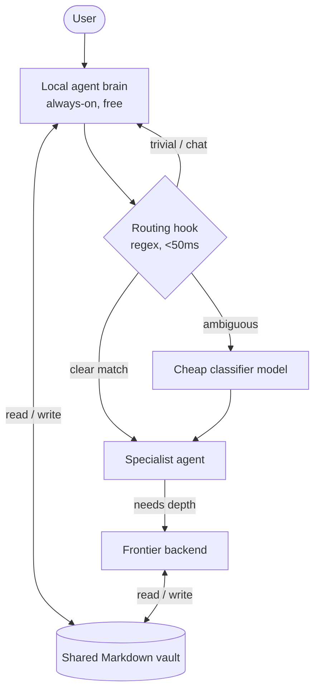

# Two-Layer Agent Architecture: Local + Frontier

A free, always-on local model handles most of the work; a frontier model is invoked only when it's genuinely worth the cost. The two coordinate through shared persistent memory.

## The problem

Frontier LLM APIs are capable but cost money on every call. A local model is free and private but weaker. I wanted a system that:

1. Routes each request to the **cheapest tier that can actually handle it**.
2. Gives both models a **shared, persistent memory** so understanding accumulates over time instead of resetting every session.
3. Keeps routing **fast and cheap** — the routing decision itself shouldn't cost an API call.

## Architecture



### Two layers, one memory

- **Local layer** — an always-on local model handles conversation, memory, scheduling, and tool-calling. (Reliable tool-calling is *why* I picked this particular model.) It's free, private, and works offline.
- **Frontier layer** — a frontier model is invoked on demand for deep reasoning, code, and analysis. The user only ever talks to the local layer; the frontier layer is a backend.
- **The coordination trick:** the two runtimes **don't share a session — they share a vault.** A folder of Markdown files (synced across machines) acts as a bidirectional message bus with a defined schema. The local layer writes the current task and which specialist should handle it; the frontier layer reads that, does the work, and writes its output back. The result is *shared memory, not shared session* — understanding persists across calls and across days.

### Routing: cheap first, expensive only when needed

The router is deliberately staged so the common case costs nothing:

1. **Stage 1 — regex hook (<50 ms, $0).** A prompt-classification hook matches keywords against an *order-sensitive* pattern table and emits a routing hint. It is **fail-open** — any error silently passes the prompt through untouched; it never blocks a request. It also detects **multi-intent** prompts (two distinct domains) and decomposes them.
2. **Stage 2 — cheap classifier.** Only when the regex is ambiguous does it escalate to a small, fast classifier model that returns exactly one agent name.
3. **Frontier escalation** happens only inside an agent that needs the depth.

**13 specialist agents across 3 cost tiers** (cheap / mid / frontier), each scoped to specific tools and a specific job (analysis, strategy, code, writing, review, research, etc.). A single config file is the source of truth for model assignments and per-token costs (including cache-read vs cache-creation rates), with a CI check that flags drift.

## Representative code: fail-open routing

The router's most important property is that it can never break the conversation:

```python
def route(prompt: str) -> str | None:
    try:
        if _is_trivial(prompt):
            return None                      # let the local layer just answer
        matches = [name for name, pat in PATTERNS if pat.search(prompt)]
        if len(_distinct_domains(matches)) >= 2:
            return "strategist"              # multi-intent → decompose
        return matches[0] if matches else None
    except Exception:
        return None                          # fail-open: never block a prompt
```

Order matters in `PATTERNS` — specific domain agents are checked before generic action verbs before open-ended planning — so the table is intentionally not alphabetized.

## Designed to get smarter

Every routing decision — what was chosen, the confidence, the matched pattern, latency, token counts — is appended to a JSONL log. Combined with each agent logging its own invocations, this produces a **ground-truth routing dataset**. The explicit roadmap is to train a learned router on it (a RouteLLM-style model), replacing hand-written rules with one fit to actual behavior. The cheap heuristic layer earns its keep today *and* generates the data to replace itself.

## What this demonstrates

- Cost-aware system design: match work to the cheapest sufficient resource.
- Multi-agent orchestration with scoped tools and tiered models.
- A pragmatic, novel coordination pattern (shared files as a durable message bus).
- Safety-first engineering: fail-open routing that degrades gracefully.
- Instrumentation with a purpose — logging today's decisions to learn tomorrow's.

> Sanitized: agent names, exact tool scopes, and infrastructure details are generalized.
