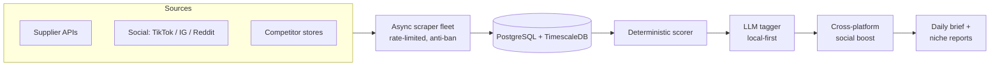

# Market Intelligence Pipeline

An always-on system that scrapes product and social-media data from heavily-defended sites, scores opportunities deterministically, and writes daily briefs, at near-zero LLM cost.

## The problem

Two hard parts:

1. **Scraping sites that actively fight scrapers** — TikTok, Instagram, Facebook, and Shopify stores all deploy bot detection, rate limits, and IP bans. A scraper that hammers them gets blocked within minutes.
2. **Turning noise into a ranked decision** — raw scrape data is messy and high-volume. The output needs to be a small, trustworthy shortlist, not a data dump.

## Architecture



A scheduler runs ~15 jobs on independent cadences — supplier agents, social agents, a daily scorer/brief, health checks. Each agent inherits a common base class that handles the hard parts of staying unbanned.

## The anti-ban core: adaptive token-bucket rate limiter

Every agent shares a rate limiter that refills continuously, detects bans, and **adapts its own aggressiveness** based on success or failure:

```python
class RateLimitGovernor:
    def __init__(self, requests_per_hour: int):
        self.capacity = requests_per_hour
        self.tokens = float(requests_per_hour)
        self.refill_per_sec = requests_per_hour / 3600.0
        self.backoff = 1.0           # 1.0 = full speed, shrinks under pressure
        self._last = time.monotonic()

    def _refill(self):
        now = time.monotonic()
        self.tokens = min(self.capacity,
                          self.tokens + (now - self._last) * self.refill_per_sec)
        self._last = now

    def on_ban(self):
        self.backoff = max(0.1, self.backoff * 0.5)   # halve on ban signal

    def on_success(self):
        self.backoff = min(1.0, self.backoff * 1.05)  # recover slowly
```

Ban detection inspects HTTP status (403, Cloudflare 503), response bodies (captcha / "verify you are human"), and triggers a multi-hour cooldown. On top of this: a rotating realistic user-agent pool, optional residential proxy support, exponential backoff with jitter on 429s, and the detail I'm proudest of: **persistent hashtag rotation**, a counter saved to disk so that across runs the scraper cycles through ~60 hashtags 20 at a time, instead of doing 60 rapid navigations in one session and tripping detection.

## Reading TikTok's internal API

The most effective scraping technique here wasn't scraping the page at all. Using a headless browser, I register a response listener and **intercept the internal XHR** the page itself makes to fetch trend data:

```python
async def _capture_trend_api(self, page):
    captured = {}
    async def on_response(resp):
        if "challenge/detail" in resp.url:           # the page's own trend API
            data = await resp.json()
            captured["views"] = data["challengeInfo"]["stats"]["viewCount"]
            captured["videos"] = data["challengeInfo"]["stats"]["videoCount"]
    page.on("response", on_response)
    await page.goto(self._hashtag_url(), wait_until="networkidle")
    return captured
```

This yields exact, quantified view counts (stored in a big-integer column to hold billions of views) instead of brittle DOM scraping. There are two DOM-based fallbacks if interception fails.

## Deterministic scoring: the LLM never owns the rank

A core design principle: **the numeric ranking is deterministic; the LLM only annotates.** The scorer computes a weighted composite from margin (assuming a markup multiple, normalized against a floor), sales velocity (log-normalized), and competition (inverse of review-count tiers, so emerging products score higher), with hard disqualifiers and *source-aware exceptions* (skip rating checks for sources that don't expose ratings). Only then does a **local** LLM add a single tag (impulse-buy / utility / branded-risk / niche-fit) with a rationale — and only the highest-scoring items escalate to a frontier model. Routine tagging stays free.

A separate niche evaluator clusters products into categories using **word-boundary regex** matching — fixing a real substring bug where `"mic"` matched `"ergonoMIC"` and `"pet"` matched `"carPET"`. That exact regression is covered by a unit test.

## Data layer

- **PostgreSQL + TimescaleDB**: price and engagement history are stored in **hypertables** — genuine time-series modeling, so I can detect price drops and engagement spikes over time rather than just snapshots.
- A change-detection log distinguishes *new* / *price-drop* / *engagement-spike* events via content hashing.
- A **self-growing competitor list**: a discovery agent finds new competitor stores via search dorks, stores them, and the competitor scraper picks them up automatically, so the target list expands itself.

## Testing

pytest covers the load-bearing pure logic: the rate limiter's token math (consumption, refill capping, ban-halving-then-recovery, the backoff floor) and the niche classifier (including the word-boundary regression). The Playwright scrapers and live API paths aren't unit-tested, an honest limitation typical of session-dependent scrapers.

## What this demonstrates

- Real-world web automation: rate-limit engineering, anti-detection, API interception.
- Separation of concerns: deterministic math for decisions, LLM for annotation only.
- Cost discipline: local-first LLM, frontier only for high-value items.
- Time-series data modeling and change detection.
- Testing the parts that carry correctness risk.

> Sanitized: target sites, niches, competitor domains, proxy details, and credentials are omitted. The techniques shown are standard web-automation practice.
