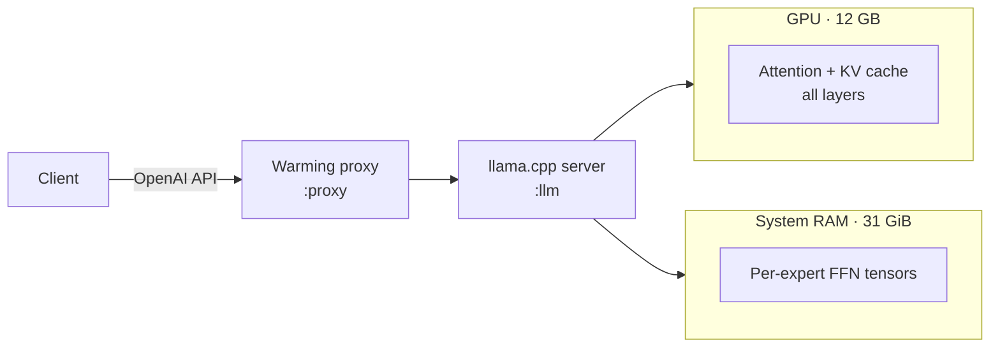

# Self-Hosted 35B LLM Serving on a 12 GB Consumer GPU

Running a 35-billion-parameter language model locally, fast, on hardware that "shouldn't" fit it — and tuning every decision from measured data.

## The problem

I wanted a private, free, always-on language model for routine work: conversation, tool-calling, tagging, drafting. The model I chose is a **35B Mixture-of-Experts (MoE)** — 34.7B total parameters, ~3B active per token. Even at 4-bit quantization it's ~17 GB. My GPU has **12 GB** of VRAM. A naive load fails immediately.

The interesting work was making it fit *and* stay fast at long context, on an AMD card (which most of the tooling treats as second-class to NVIDIA).

## Architecture



The key insight: **don't try to fit the whole model in VRAM.** Split it by *what's expensive*, not by layer.

- **Attention + KV cache → GPU.** Attention is what gets costly as context grows, and the KV cache must be fast to read every token. `--n-gpu-layers 99` puts all of it on the card.
- **Per-expert FFN tensors → system RAM.** These are the bulk of the parameters, but with an MoE only ~3B are active per token, so the CPU — helped here by a chip with large 3D-stacked cache — serves them without becoming the bottleneck. `--n-cpu-moe N` controls how many expert layers live in RAM, and `N` is a direct **speed ↔ VRAM-headroom dial**.
- **Flash-attention + quantized KV cache → long context.** rocWMMA flash-attention plus an 8-bit KV cache fits a full 64K–128K window in the remaining VRAM.

The engine is **llama.cpp**, compiled from source for **AMD ROCm/HIP** targeting the RX 7700 XT's GPU architecture, with rocWMMA flash-attention enabled. It exposes an OpenAI-compatible server, so everything downstream just speaks the OpenAI API.

## Tuning decisions — all from measured data

I treated configuration as an experiment, not a guess. Representative findings:

| Decision | Why (measured) |
|---|---|
| **6 threads, not 8 or 16** | More threads regressed throughput — SMT contention collapsed generation to ~11 t/s at 16 threads. |
| **8-bit KV cache, not 4-bit** | 4-bit was faster at idle but *slower at depth* (22 vs 26 t/s at 50K context) and nearly ran out of memory. Quality kept too. |
| **No speculative decoding** | The vocabulary is huge (no good draft model exists) and an MoE is already cheap per token — there was nothing for a draft model to save. |
| **CPU governor → performance, GPU → high power** | Applied via a one-shot boot service; measurable, persistent gains. |

**Measured performance:** ~518 tokens/s prompt processing, ~32 t/s generation shallow, holding **26 t/s at 50K context** with verified needle-in-haystack retrieval (no truncation). The honest cost: prefill is slow — a 50K-token prompt takes minutes to first token. That tradeoff is *why* the agent layer (next doc) routes very long or latency-sensitive prompts to a frontier model instead.

## The overnight benchmark harness

Rather than hand-tune, I built an unattended optimizer that runs while I sleep:

1. Takes a file lock that the live server polls — so the production stack **idles instead of fighting for the GPU** (a privilege-free handoff).
2. Sweeps llama.cpp configurations with the benchmarking tool.
3. **Soak-tests** the top finalists under sustained load, sampling GPU temperature and VRAM over time to catch thermal throttling and memory drift.
4. Scores candidates (sustained throughput, throttle %, VRAM drift, max temp), writes the winner to a config file the server sources at launch, restarts the stack, and files a report.
5. A shell `trap` guarantees the production stack is restored on *any* exit path.

A real run picked a config sustaining 38 t/s with 0% throttle and -0.01 GiB VRAM drift at 68°C — and the server picked it up on next launch with no code change.

## The cold-start warming proxy

After a reboot, the first real request has to ingest the agent's large (~26K-token) system prompt from an empty cache — about **77 seconds of dead air** that looks like a hang. I put a small reverse proxy in front of the server that solves this (and one more thing):

```python
async def _warm_supervisor(self):
    """Replay the cached system-prompt prefix whenever the upstream
    transitions down → up (boot, model reload, crash recovery)."""
    was_up = False
    while True:
        up = await self._upstream_healthy()
        if up and not was_up and self._cached_prefix:
            # max_tokens=1: we only want to prime the KV cache, not generate
            await self._replay(self._cached_prefix, max_tokens=1)
        was_up = up
        await asyncio.sleep(self.poll_interval)
```

Because the proxy and the model server are separate services, warming on the health-check *edge* is the only way to re-prime the cache after a model-only restart. The proxy also **suppresses the model's "thinking" tokens on simple turns** (tool results, short messages), which cut trivial-query latency about 6×, while keeping bounded reasoning for genuinely hard prompts.

## What this demonstrates

- Systems-level reasoning about a real hardware constraint (split by cost, not by layer).
- Empirical engineering: measure, don't assume — every knob is backed by a number.
- Automation of my own workflow (the benchmark harness) with safe concurrency (lock-based handoff, guaranteed cleanup).
- Production concerns: cold-start latency, service orchestration, graceful degradation.

> Sanitized: this write-up describes the architecture and decisions. Exact host names, ports, and file paths are omitted.
