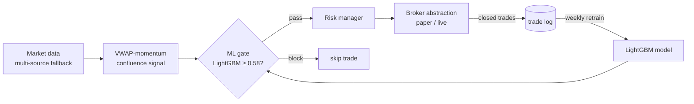

# Algorithmic Trading System

An intraday options strategy where a technical signal is gated by a machine-learning classifier — built with the time-series discipline that keeps a backtest honest.

> **Disclaimer:** this documents an engineering project. It runs on a paper-trading account by default and is **not financial advice**. The interesting content here is the ML methodology and system design, not the strategy's returns.

## The problem

A pure technical signal (e.g. a VWAP crossover) fires often and generates a lot of losing trades. The goal was to **filter** those signals with a model — without committing the cardinal sin of time-series ML: leaking future information into training.

## Architecture



## The signal

A confluence filter that requires *all* of: a session-anchored VWAP crossover, RSI confirmation, a volume spike (≥1.5× the rolling average), trend alignment, and a minimum volatility floor (so it doesn't trade flat, decay-prone days). It only scans during the two intraday windows where momentum actually shows up, and suppresses re-entry in the same direction until a reset.

## The ML gate — and how the features are built

After a signal fires, a feature vector is scored by a **LightGBM** classifier, and the trade is blocked unless the predicted probability clears a threshold. Features include VWAP distance, two RSI windows, volume ratio, normalized ATR, Bollinger position, momentum at two horizons, VWAP slope, time-of-day features, and distance from the opening-range midpoint.

The detail I think is sharp: **directional features are sign-flipped for short (put) signals**, so the model learns a single canonical "in-favor-of-the-trade" representation instead of having to learn long and short setups separately:

```python
def build_features(bar, direction):
    f = raw_features(bar)
    if direction == "put":                # flip directional features so the model
        for k in ("vwap_dist", "mom5", "mom20", "vwap_slope", "or_dist"):
            f[k] = -f[k]                   # sees one consistent "with-trend" frame
    return f
```

The gate also **fails open** — on any inference error or missing model it returns probability 1.0, so a broken model degrades to "trade the raw signal" rather than silently halting everything.

## The methodology that matters: walk-forward CV

This is the part that separates a real backtest from a fantasy one. Labels are generated by replaying the *same* signal logic over history and forward-labeling each signal as a win if price moved enough in the predicted direction within a forward window. The model is then evaluated with **walk-forward (expanding-window) cross-validation** — train on the past, test on the future, never shuffle:

```python
def walk_forward_cv(X, y, n_folds=5):
    fold = len(X) // (n_folds + 1)
    scores = []
    for i in range(1, n_folds + 1):
        tr = slice(0, fold * i)             # expanding past
        te = slice(fold * i, fold * (i + 1))  # the immediate future
        model.fit(X[tr], y[tr])
        scores.append(evaluate(model, X[te], y[te]))  # precision / recall / F1 / AUC
    return scores
```

Shuffled cross-validation would let the model peek at the future and report fake accuracy. Expanding-window CV is the honest measure for financial time series. There's also a live feedback loop: once enough real closed trades accumulate, the model **retrains weekly from actual outcomes**, not just historical replay.

## Risk and execution

- A **risk manager** enforces position sizing (a fraction of capital, hard contract cap), a max number of concurrent positions, a daily loss limit that halts new entries, per-position stop-loss / profit-target levels, and a forced flat close before the bell.
- A neat realism detail: paper accounts start with far more cash than the real one, so position sizing uses `min(broker_cash, realistic_capital + cumulative_pnl)` — paper sizing stays true to the real account.
- A **pluggable broker abstraction**: paper and live brokers implement one interface, selected by a flag, including the fiddly translation between standard option-symbol format and each broker's contract objects.

## Backtesting

A vectorized, event-driven backtester runs over ~2 years of minute bars, models option P&L from the underlying move via a delta/leverage proxy with time-decay drag, and reports CAGR, annualized Sharpe, max drawdown, profit factor, win rate, and a monthly P&L table. A separate optimizer does grid search over parameters and analyzes performance by market regime. Data comes through a unified bus with **automatic fallback chains** across multiple providers, and self-rate-limiting to respect free-tier limits. History is cached locally as compressed Parquet.

## What this demonstrates

- Correct time-series ML: walk-forward validation, leak-free label generation, retraining from live outcomes.
- Thoughtful feature engineering (the directional sign-flip).
- Defensive system design: fail-open gating, hard risk limits, realistic paper sizing.
- Clean abstraction (one broker interface, swappable backends) and rigorous evaluation.

> Sanitized: exact thresholds, instruments, credentials, and account details are omitted or generalized.
