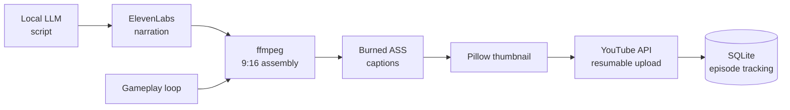

# Automated Video Factory

A fully automated short-form video pipeline: a local model writes the script, narration is synthesized, raw ffmpeg assembles a captioned vertical video, and it's uploaded — for about ten cents an episode.

## The problem

Produce finished, captioned vertical videos end-to-end with no manual steps and no expensive dependencies. Specifically: no paid forced-alignment service for caption timing, no heavyweight video framework — just the primitives, orchestrated.

## Architecture



A scheduler runs the pipeline daily; each episode is tracked in SQLite with dedup, and a dry-run mode produces a script with zero API spend.

## The pieces, and the non-obvious bits

**Script generation — free.** The story is written by the *local* LLM (zero API cost), choosing a format by weighted random selection and parsing structured sections out of the response. The one trick: the local model's "thinking" tokens would otherwise consume the whole budget and return empty content, so the request explicitly disables them:

```python
resp = client.chat.completions.create(
    model="local",
    messages=msgs,
    extra_body={"chat_template_kwargs": {"enable_thinking": False}},
)
```

**Narration.** Text is chunked at sentence boundaries under the API's character limit, each chunk synthesized with per-chunk retry and exponential backoff on rate limits, then the audio parts are concatenated.

**Assembly — raw ffmpeg, no moviepy.** A gameplay clip is looped infinitely, cropped/scaled/padded to **1080×1920** vertical, the narration is mixed in, and the whole thing is trimmed to the audio's duration and encoded to H.264/AAC — all via ffmpeg invocations.

**Captions — timing without forced alignment.** Rather than pay for word-level alignment, captions are timed from the narration's word count and an average speaking rate (~2.25 words/sec), split into short on-screen chunks in the familiar bold style, written as an ASS subtitle file (with proper escaping), and burned in with ffmpeg's subtitle filter:

```python
def estimate_caption_timing(words, wps=2.25):
    t = 0.0
    for chunk in chunked(words, size=4):      # ~4 words on screen at once
        dur = len(chunk) / wps
        yield (t, t + dur, " ".join(chunk))
        t += dur
```

It's an approximation, but for narrated short-form it reads correctly and costs nothing.

**Thumbnail.** Generated with Pillow — a gradient background with the wrapped, bold title.

**Upload.** OAuth2 desktop flow with a persisted/refreshed token, and a **resumable chunked upload** so a large file survives a flaky connection, plus full metadata (title, tags, category, privacy) and a custom thumbnail.

## What this demonstrates

- Gluing several APIs and tools into a hands-off pipeline, with scheduling and state tracking.
- Working at the primitive level (ffmpeg, ASS subtitles) instead of reaching for a heavy framework.
- Cost-conscious design: local LLM for generation, a clever heuristic instead of a paid alignment service — marginal cost is just text-to-speech.
- Robustness details that matter in automation: retries with backoff, resumable uploads, dedup.

> Sanitized: API keys, voice/channel identifiers, and file paths are omitted.
